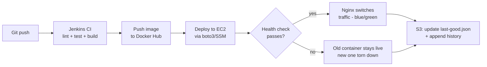

# ZeroDownPipeline — Zero-Downtime CI/CD Pipeline with Automated Rollback

> A Dockerized Python API deployed through a Jenkins pipeline to a single free-tier AWS EC2 instance, using a blue-green switch and an automated health check gate so a broken deploy never reaches users — and rolls itself back with zero manual intervention.

**Instructions for the assistant picking this up:** This document is the full spec for the project. Implement it end-to-end — write the application code, Dockerfile, Jenkinsfile, infrastructure automation scripts, and deployment/rollback scripts described below, in the repo structure given. Ask a clarifying question only if something is genuinely blocking; otherwise make the same kind of reasonable default choices this spec already makes (e.g. exact port numbers, file names) and keep moving. Work through the Implementation Checklist near the bottom in order.

---

## 1. Why this project exists

Built to demonstrate DevOps fundamentals for SDE1-DevOps style roles, specifically closing these gaps with hands-on, provable work:
- CI/CD pipeline design (Jenkins)
- Containerization (Docker)
- AWS infrastructure automation via SDK/CLI (boto3), not just the console
- Deployment reliability engineering (health checks, automated rollback, zero-downtime)
- Using S3 as a lightweight, free-tier-friendly data store

Everything is scoped to **AWS free tier**: one t2.micro/t3.micro EC2 instance, S3, and (optionally) CloudWatch — no RDS, no managed load balancer, no EKS.

## 2. Goals & success criteria

The project is "done" when:
- [ ] A git push triggers a Jenkins pipeline with no manual steps
- [ ] A healthy deploy results in **zero observed downtime**
- [ ] A deliberately broken deploy is caught by the health check and **automatically rolled back** — old version keeps serving, no human intervention
- [ ] All AWS infrastructure can be created and destroyed via script (no manual console clicks)
- [ ] Real numbers are measured and recorded (see Section 12) — not estimated

## 3. Tech stack

| Layer | Choice |
|---|---|
| Application | Python (Flask or FastAPI) |
| Data store | AWS S3 (JSON objects, versioning enabled) |
| Containerization | Docker |
| CI/CD | Jenkins (declarative pipeline) |
| Infra automation | boto3 (AWS SDK for Python) + AWS CLI |
| Compute | AWS EC2 free tier (t2.micro / t3.micro) |
| Traffic switching | Nginx reverse proxy (blue-green) |
| Registry | Docker Hub (free) |
| Monitoring (optional) | CloudWatch Logs + basic alarm |

## 4. Architecture



Two containers can run on the same EC2 instance at once, on different ports (blue = 8000, green = 8001). Only one is ever receiving live traffic (via Nginx), the other is either idle or being health-checked before promotion.

## 5. Application design

Pick **one** simple app so most effort goes into the pipeline, not app logic. Default choice: **URL shortener.**

Endpoints:
- `POST /shorten` — body `{"url": "..."}` → returns `{"short_code": "...", "short_url": "..."}`
- `GET /<short_code>` — 302 redirect to original URL, increments click count
- `GET /stats/<short_code>` — returns `{"original_url", "clicks", "created_at"}`
- `GET /health` — returns `{"status": "ok", "version": "<git-sha>"}`, used by the pipeline's health check

(Swap for a notes/task API if preferred — the S3 schema and pipeline logic below don't change.)

## 6. S3 design — data store + deployment history

Two buckets (or two prefixes in one bucket — buckets must be globally unique, e.g. `zerodownpipeline-data-<yourname>`):

### 6a. Application data — `records/`
- `records/{short_code}.json` → `{"short_code", "original_url", "created_at", "clicks"}`
- **Enable S3 bucket versioning.** Every write creates a new object version automatically — this gives you a full change history and point-in-time recovery of the data for free, with zero extra code.

### 6b. Deployment / image version history — `deployments/`
- `deployments/history.json` — append-only log of every deploy attempt:
  ```json
  [{"image_tag": "abc1234", "deployed_at": "...", "status": "success", "health_check": "passed"}]
  ```
- `deployments/last-good.json` — pointer to the current known-good image, e.g. `{"image_tag": "abc1234", "port": 8000}`. **Only updated after a successful health check and traffic switch.** The rollback script reads this file to know exactly what "good" means.

This is what makes rollback trustworthy: you're never guessing which image was last stable — S3 has the answer.

## 7. Docker

- `python:3.11-slim` base image, non-root user, multi-stage build if you want to show that skill too
- Tag images as `<dockerhub-user>/zerodownpipeline-api:<git-short-sha>` — never deploy `:latest`, always deploy by SHA so rollback is unambiguous
- Expose the app port; Nginx handles the external port 80

## 8. AWS infrastructure automation (`infra/`)

`infra/provision.py` (boto3):
- Create the S3 bucket(s) if they don't exist, enable versioning
- Create a security group allowing 22 (SSH, restrict to your IP), 80 (HTTP), 8000 & 8001 (app ports, or keep those internal-only if Nginx is the only public entry point)
- Launch the EC2 instance with `user_data` that installs Docker and Nginx on first boot
- Write the instance's public IP to `infra/outputs.json` so Jenkins/deploy scripts can read it

`infra/teardown.py`:
- Terminate the instance (guard destructive S3 deletes behind a `--confirm` flag)

This script pair is your direct proof point for "automating processes with AWS SDK/CLI tools."

## 9. Jenkins pipeline (`Jenkinsfile`)

Stages, in order:
1. **Checkout**
2. **Lint** (flake8 or ruff)
3. **Test** (pytest)
4. **Build** — Docker image tagged with git short SHA
5. **Push** — to Docker Hub
6. **Deploy** — trigger `deploy/deploy.py`, passing the new image tag; it starts the new container on the *inactive* port
7. **Health check** — `deploy/healthcheck.py` polls the new container's `/health`, 5–10 retries, few seconds apart
8. **Promote or rollback** (see below)

## 10. Promotion / rollback logic (`deploy/`)

**On health check success:**
1. Update Nginx's upstream config to point at the new (now active) port, `nginx -s reload` (graceful, no dropped connections)
2. Stop the old container after a short grace period
3. Update `deployments/last-good.json` in S3
4. Append a `"success"` entry to `deployments/history.json`

**On health check failure:**
1. Stop and remove the new (broken) container — old container was never touched, still serving
2. Append a `"failed"` entry to `deployments/history.json`
3. (Optional) publish an SNS notification / send an email

This is the whole point of the project: deploys can fail safely, with no human needed to notice or intervene.

## 11. Monitoring (optional, keep light)

- CloudWatch Agent via `user_data` to ship basic instance metrics/logs (free tier: 5GB log ingestion)
- One CloudWatch alarm (e.g. EC2 status check failure) → SNS email

## 12. Metrics to measure and record (for resume bullets — measure, don't estimate)

- End-to-end pipeline duration: git push → live traffic switch
- Manual deploy time (baseline, done once by hand) vs automated deploy time
- Time to automatic rollback after a deliberately broken deploy (this is your MTTR number)
- Number of manual steps eliminated (count them, before vs after)

## 13. Repo structure

```
zerodownpipeline/
├── app/
│   ├── main.py
│   ├── s3_store.py
│   ├── requirements.txt
│   └── tests/
│       └── test_main.py
├── Dockerfile
├── Jenkinsfile
├── infra/
│   ├── provision.py
│   └── teardown.py
├── deploy/
│   ├── deploy.py
│   ├── healthcheck.py
│   ├── rollback.py
│   └── nginx/
│       └── app.conf.template
├── docs/
│   └── (architecture diagram, README screenshots)
├── README.md
└── .env.example
```

## 14. Implementation checklist

- [ ] Write the Python API (`app/main.py`) with S3 read/write and `/health`
- [ ] Write `app/s3_store.py` and unit tests
- [ ] Write Dockerfile, build and run locally to confirm it works
- [ ] Write `infra/provision.py`, run it, confirm EC2 + S3 exist and are reachable
- [ ] Manually deploy once by hand, time it (baseline metric)
- [ ] Write `Jenkinsfile` stages 1–5 (checkout → push image), confirm they run
- [ ] Write `deploy/deploy.py` (start new container on inactive port)
- [ ] Write `deploy/healthcheck.py`
- [ ] Write `deploy/rollback.py` and the Nginx switch logic
- [ ] Wire stages 6–8 into the Jenkinsfile
- [ ] Test a successful deploy end-to-end, measure the time
- [ ] Deliberately break a deploy (bad code/bad port), confirm automatic rollback happens, measure the time
- [ ] Add CloudWatch logging/alarm (optional)
- [ ] Write the README with the architecture diagram and real measured numbers
- [ ] Write `infra/teardown.py` and confirm a clean teardown

## 15. Interview talking points (for later, keep for reference)

**Short version:** "A CI/CD pipeline that deploys a Python API with zero downtime and automatic rollback — a broken deploy never reaches users."

**Follow-ups to be ready for:**
- *Why S3 instead of a real database?* Free-tier friendly, legitimate pattern for simple key-value data; would use RDS/DynamoDB at real scale.
- *Why build rollback yourself instead of using a managed service?* Free tier has no load balancer/managed deploy service — this replicates the same reliability guarantee with Nginx + a script, and shows understanding of the underlying problem, not just the tool.
- *What would you change for production?* Managed DB instead of S3, ALB instead of self-managed Nginx switching, multiple instances instead of one, secrets in Secrets Manager instead of env vars.
